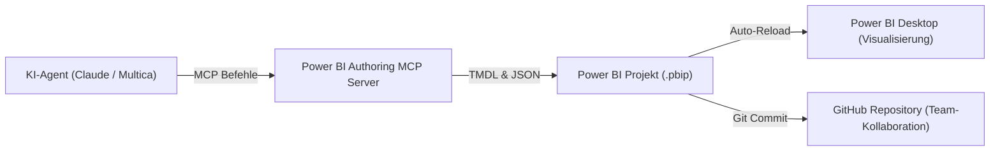

Power BI galt lange Zeit als geschlossenes System für visuelle Analysten: Klick-basiert, proprietär und isoliert von moderner Softwareentwicklung. Mit der Einführung des PBIP-Formats (Power BI Project) und dem Model Context Protocol (MCP) bricht Microsoft dieses Silo auf. Für die Wirtschaftsinformatik markiert dieser Schritt einen grundlegenden Wandel: Business Intelligence wird quelltextbasiert, modular automatisierbar und direkt für autonome KI-Agenten steuerbar.

Dieser Fachartikel analysiert die technische Architektur hinter diesem Paradigmenwechsel, zeigt den Unterschied zwischen PBIX und PBIP und demonstriert, wie KI-Modelle Datenmodelle deklarativ über TMDL und MCP verändern.

---

## 1. Einleitung und Ausgangslage: Das Dilemma der binären Blackbox

Klassische Power-BI-Dateien mit der Endung `.pbix` sind monolithische Binärpakete (ZIP-Archive). Für den einzelnen Anwender am lokalen Desktop ist das bequem, in professionellen Enterprise-Umgebungen erzeugt dieses Format jedoch erhebliche Reibungsverluste:

- **Keine Versionskontrolle:** Git kann Binärdateien nicht zusammenführen. Ein Merge-Konflikt zweier Entwickler an derselben `.pbix`-Datei lässt sich nicht zeilenbasiert auflösen.
- **Fehlende Transparenz:** Code-Reviews von DAX-Formeln oder Datenbeziehungen erforderten das Öffnen der gesamten Datei in Power BI Desktop.
- **Ausschluss moderner KI-Tools:** Große Sprachmodelle (LLMs) benötigen Klartext, um semantische Strukturen zu analysieren oder Code zu generieren. Sie scheiterten an der komprimierten Binärstruktur.

Unternehmen standen daher vor einem klassischen Governance-Konflikt: Einerseits liefert Power BI den vom Management geforderten Standard, andererseits behinderte das Dateiformat agile Kollaboration, Team-Reviews und moderne CI/CD-Pipelines.

---

## 2. Die zwei Dokumenttypen: PBIX vs. PBIP

Mit dem Format `Power BI Project` (`.pbip`) hat Microsoft die Dateiarchitektur grundlegend erneuert. Anstelle eines einzigen Archivs speichert Power BI das Projekt in einer transparenten Ordnerstruktur mit zwei Kernbereichen:

1. **Semantic Model Ordner (`<Name>.Dataset` bzw. `<Name>.SemanticModel`):**
   Enthält alle Definitionen des Datenmodells im Klartextformat TMDL (Tabular Model Definition Language). Tabellen, Beziehungen, Partitionen und DAX-Measures sind in separaten Textdateien organisiert.
2. **Report Ordner (`<Name>.Report`):**
   Beinhaltet die visuellen Layouts, Diagramme, Filterkonfigurationen und Formatierungen in JSON-Dateien (`report.json` bzw. PBIR-Struktur).

### Direkter Architekturvergleich

| Kriterium | Klassisches PBIX | Power BI Project (PBIP) |
| :--- | :--- | :--- |
| **Dateiformat** | Monolithisches Binärarchiv (ZIP) | Modularer Text- und Ordnerbaum |
| **Versionsverwaltung** | Reine Dateispeicherung ohne Diffs | Vollständige Git-Integration mit Zeilen-Diffs |
| **Team-Kollaboration** | Seriell (Gefahr des Überschreibens) | Parallel (Feature Branches und Pull Requests) |
| **KI-Zugänglichkeit** | Geschlossene Blackbox | Direkter Lese- und Schreibzugriff auf Code |
| **Governance & Review** | Manuelle Sichtprüfung im Desktop-Tool | Automatisierte Linter und Peer Reviews in GitHub |

Durch diese Trennung von Metadaten, Berechnungslogik und Visualisierung wird Power BI erstmals vollständig anschlussfähig an etablierte DevOps-Praktiken.

---

## 3. Direkte Dateibearbeitung durch KI: TMDL und Berichts-JSON

Da ein PBIP-Projekt aus reinem Text besteht, können moderne KI-Assistenten (wie Claude Code, OpenAI GPT oder Antigravity) das Projekt direkt im Dateisystem bearbeiten. Zwei Schnittstellen stehen dabei im Mittelpunkt:

### 3.1 Modellierung in TMDL (Tabular Model Definition Language)
TMDL ist eine von Microsoft entwickelte, deklarative Sprache für tabellarische Datenmodelle. Sie ist präzise, kompakt und für Sprachmodelle ideal lesbar. Eine KI kann bestehende Schemata analysieren und neue DAX-Measures fehlerfrei nach Standardvorgaben einfügen.

```tmdl
table Sales

    measure 'Total Revenue' = SUM(Sales[Amount])
        formatString: #,##0.00
        displayFolder: "Base Metrics"

    measure 'YTD Revenue' = 
        CALCULATE(
            [Total Revenue],
            DATESYTD('Date'[Date])
        )
        formatString: #,##0.00
        displayFolder: "Time Intelligence"
```

Statt in Power BI Desktop durch verschachtelte Menüs zu klicken, liest die KI den semantischen Kontext des Modells, versteht Beziehungen und erstellt syntaktisch korrektes DAX direkt in der jeweiligen Modelldatei.

### 3.2 Manipulation visueller Berichte via JSON
Auch die Visualisierungs-Ebene lässt sich automatisieren. Die Datei `report.json` (oder PBIR) beschreibt jedes Diagramm, dessen Koordinaten, Farbpaletten und gebundene Felder. Eine KI kann:
- CI-konforme Farbpaletten über alle Berichtsseiten hinweg vereinheitlichen.
- Neue Diagramm-Container für neu erstellte Kennzahlen automatisiert im JSON-Baum anlegen.
- Barrierefreie Bezeichnungen und Tooltips konsistent pflegen.

---

## 4. Die Steuerung über MCP: Power BI Authoring MCP Server

Die direkte Dateibearbeitung ist mächtig, birgt jedoch das Risiko ungültiger Syntax, wenn die KI ohne Rückmeldung agiert. Hier kommt das **Model Context Protocol (MCP)** ins Spiel, ein offener Standard zur Interaktion zwischen LLMs und Entwicklungsumgebungen.

Microsoft stellt dafür den **Power BI Authoring MCP Server** bereit (ursprünglich als Power BI Modeling MCP Server eingeführt). Dieser fungiert als universelle Schnittstelle zwischen KI-Agenten und der Microsoft BI-Engine.

### Funktionsweise und Agenten-Integration
1. **Verbindung zur Engine:** Der MCP-Server klinkt sich direkt an die lokale Analysis-Services-Instanz an, die während der Ausführung von Power BI Desktop im Hintergrund läuft, oder greift auf das PBIP-Dateisystem zu.
2. **Tool-Execution:** Der Agent erhält strukturierte Werkzeuge:
   - `create_measure`: Erstellt DAX-Measures mit automatischer Validierung.
   - `execute_dax`: Führt Testabfragen auf dem Modell aus, um die Korrektheit der Daten vorab zu prüfen.
   - `list_tables` und `describe_model`: Verschafft dem Agenten den semantischen Überblick über das Schema.
3. **Sofortige Rückmeldung:** Schlägt eine DAX-Formel fehl, erhält der Agent die Fehlermeldung der Engine im selben Schritt zurück und korrigiert seinen Code autonom.

### Architektur-Übersicht



Dieser geschlossene Kreislauf verwandelt die BI-Entwicklung von manueller Fleißarbeit in eine assistierte Co-Creation: Der Mensch definiert die Business-Logik und Governance-Regeln, der Agent setzt Datenmodellierung und Berichtslayout präzise um.

---

## 5. Wirtschaftsinformatik-Fazit: Vom Klick-Tool zur Enterprise-Governance

Der Übergang von PBIX zu PBIP und die Anbindung von KI über MCP markieren einen qualitativen Reifeschritt für die Unternehmens-IT. 

Aus Perspektive der Wirtschaftsinformatik lösen diese Technologien eine zentrale Kernspannung auf:
- **Konzerne fordern Governance:** Fachbereiche dürfen keine unkontrollierte Schatten-IT aufbauen. Zentrale Standardplattformen wie Power BI und Microsoft Fabric garantieren Datensicherheit, einheitliche Rollenrechte und Compliance.
- **Fachbereiche fordern Agilität:** Traditionelle Anpassungszyklen in zentralen BI-Teams dauern oft Wochen.

Durch quelltextbasierte Power-BI-Projekte und agentische KI-Unterstützung schrumpft diese Kluft. Datenmodelle werden in Versionsverwaltungssystemen versioniert, automatisierte Tests sichern die Kennzahlen ab, und KI-Agenten beschleunigen Routineaufgaben bei der Berichterstellung.

Business Intelligence wandelt sich von einer manuellen Gestaltungsaufgabe zu einer disziplinierten Form des Software Engineerings: Business Intelligence as Code, orchestriert durch künstliche Intelligenz und abgesichert durch etablierte Enterprise-Governance.
