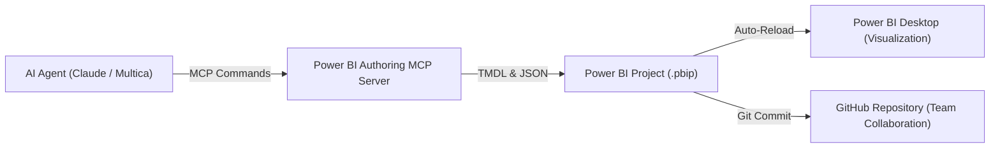

Power BI was long considered a closed ecosystem for visual analysts: click-driven, proprietary, and detached from modern software development workflows. With the introduction of the PBIP format (Power BI Project) and the Model Context Protocol (MCP), Microsoft breaks open this silo. For business informatics, this step marks a fundamental transformation: business intelligence becomes source-code-based, modularly automatable, and directly controllable by autonomous AI agents.

This technical article analyzes the architectural shift behind this transition, compares PBIX with PBIP, and demonstrates how modern AI models interact with tabular data models declaratively through TMDL and MCP.

---

## 1. Introduction and Context: The Binary Black Box Dilemma

Traditional Power BI files with the `.pbix` extension are monolithic binary packages (ZIP archives). While convenient for individual analysts working locally on a desktop, this format creates major friction in enterprise software engineering:

- **Lack of Version Control:** Git cannot merge binary files. A merge conflict between two developers modifying the same `.pbix` file cannot be resolved line by line.
- **Missing Transparency:** Reviewing DAX calculations or data model relationships required opening the entire project inside Power BI Desktop.
- **Incompatibility with Modern AI Tools:** Large Language Models (LLMs) require plain text to inspect semantic architectures and generate code. They could not parse compressed binary blobs.

Enterprises faced a classic governance conflict: while Power BI delivered the standard reporting interfaces demanded by leadership, its proprietary packaging prevented agile collaboration, code reviews, and automated CI/CD pipelines.

---

## 2. The Two Document Formats: PBIX vs. PBIP

With the `Power BI Project` format (`.pbip`), Microsoft fundamentally redesigned the file architecture. Instead of a single binary archive, Power BI saves the project in a structured folder tree containing two primary components:

1. **Semantic Model Folder (`<Name>.Dataset` or `<Name>.SemanticModel`):**
   Contains all data model definitions in plain-text TMDL format (Tabular Model Definition Language). Tables, relationships, partitions, and DAX measures are split across dedicated text files.
2. **Report Folder (`<Name>.Report`):**
   Contains visual layouts, visual containers, filter configurations, and theme styling in clean JSON structures (`report.json` or PBIR definitions).

### Direct Architectural Comparison

| Criterion | Classic PBIX | Power BI Project (PBIP) |
| :--- | :--- | :--- |
| **File Format** | Monolithic binary archive (ZIP) | Modular folder and text file tree |
| **Version Control** | File snapshots without text diffs | Full Git integration with line diffs |
| **Team Collaboration** | Serial (risk of overwriting work) | Parallel (feature branches and pull requests) |
| **AI Accessibility** | Closed black box | Direct read and write access to code |
| **Governance & Review** | Manual visual inspection in desktop app | Automated linters and peer reviews on GitHub |

By decoupling metadata, business logic, and visual presentation, Power BI connects seamlessly with established DevOps and software engineering practices.

---

## 3. Direct File Manipulation by AI: TMDL and Report JSON

Because a PBIP project consists entirely of human-readable text, modern AI coding tools (such as Claude Code, OpenAI GPT, or Antigravity) can edit project files directly within the repository. Two main integration surfaces exist:

### 3.1 Modeling in TMDL (Tabular Model Definition Language)
TMDL is a declarative syntax developed by Microsoft for tabular data models. It is concise, human-readable, and optimized for LLM tokenization. An AI agent can inspect table relationships and implement verified DAX measures according to organizational conventions.

```tmdl
table Sales

    measure 'Total Revenue' = SUM(Sales[Amount])
        formatString: #,##0.00
        displayFolder: "Base Metrics"

    measure 'YTD Revenue' = 
        CALCULATE(
            [Total Revenue],
            DATESYTD('Date'[Date])
        )
        formatString: #,##0.00
        displayFolder: "Time Intelligence"
```

Rather than navigating complex UI menus in Power BI Desktop, the AI model interprets the semantic context of the business model and injects syntactically valid DAX expressions directly into the respective model file.

### 3.2 Visual Report Automation via JSON
The visualization layer can also be modified programmatically. The `report.json` (or PBIR) file describes every visual container, its layout coordinates, color palettes, and data bindings. An AI agent can:
- Standardize corporate design color palettes across all dashboard tabs.
- Scaffold chart containers for newly created measures automatically.
- Enforce accessibility rules, high-contrast labels, and clean tooltips across the enterprise.

---

## 4. MCP Automation: Power BI Authoring MCP Server

Direct text editing is powerful, but it carries the risk of syntax errors when AI models operate without feedback loops. This is where the **Model Context Protocol (MCP)** becomes essential, an open standard for real-time interaction between LLMs and development runtimes.

Microsoft provides the **Power BI Authoring MCP Server** (originally introduced as the Power BI Modeling MCP Server). It acts as a universal bridge connecting AI agents to the Microsoft BI engine.

### Operational Mechanics and Agent Integration
1. **Engine Connectivity:** The MCP server attaches directly to the local Analysis Services process running behind Power BI Desktop, or communicates with the PBIP file tree.
2. **Structured Tool Execution:** The agent receives high-level tools:
   - `create_measure`: Creates DAX measures with real-time semantic validation.
   - `execute_dax`: Runs diagnostic queries against the engine to verify calculations before finalizing code.
   - `list_tables` and `describe_model`: Delivers schema definitions and relationship hierarchies to the agent.
3. **Instant Error Feedback:** If a DAX expression fails, the engine returns the diagnostic error directly to the agent in the same tool invocation, allowing autonomous self-correction.

### Architectural Overview



This closed-loop system evolves BI development from repetitive manual configuration into assisted co-creation: engineers determine business requirements and governance boundaries, while the AI agent implements modeling logic and dashboard components with precision.

---

## 5. Business Informatics Conclusion: From Click Tools to Enterprise Governance

The transition from PBIX to PBIP and AI orchestration via MCP represents a significant leap in maturity for enterprise data systems.

From a business informatics perspective, these innovations resolve a classic tension:
- **Enterprises Require Strict Governance:** Business units must not build uncontrolled shadow IT. Central standard platforms such as Power BI and Microsoft Fabric ensure data security, role-based access control, and compliance.
- **Business Teams Demand Agility:** Traditional reporting request cycles in centralized teams often take weeks.

With source-code-based Power BI projects and agentic AI tooling, that gap closes. Semantic models are versioned in Git, automated unit tests validate metrics, and AI assistants eliminate manual reporting overhead.

Business intelligence shifts from manual presentation design to a disciplined software engineering discipline: Business Intelligence as Code, powered by artificial intelligence and protected by enterprise governance.
