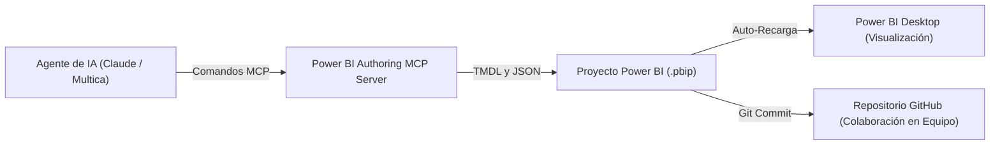

Durante mucho tiempo, Power BI se consideró un ecosistema cerrado para analistas visuales: basado en clics, propietario y aislado de los flujos de trabajo de la ingeniería de software moderna. Con la introducción del formato PBIP (Power BI Project) y el Model Context Protocol (MCP), Microsoft derriba este silo. Para la informática empresarial, este avance marca una transformación fundamental: Business Intelligence pasa a estar basada en código fuente, automatizable de forma modular y gobernable directamente por agentes autónomos de inteligencia artificial.

Este artículo técnico examina la arquitectura detrás de este cambio de paradigma, compara el formato PBIX con PBIP y demuestra cómo los modelos de IA manipulan modelos de datos tabulares de forma declarativa a través de TMDL y MCP.

---

## 1. Introducción y contexto: El dilema de la caja negra binaria

Los archivos tradicionales de Power BI con extensión `.pbix` son paquetes binarios monolíticos (archivos comprimidos ZIP). Aunque esto resulta cómodo para un analista individual en su computadora local, en entornos corporativos genera fricciones considerables:

- **Sin control de versiones:** Git no puede combinar archivos binarios. Un conflicto de fusión entre dos desarrolladores sobre el mismo archivo `.pbix` no se puede resolver línea por línea.
- **Falta de transparencia:** La revisión de fórmulas DAX o de relaciones entre tablas exigía abrir el archivo completo en Power BI Desktop.
- **Incompatibilidad con herramientas modernas de IA:** Los modelos de lenguaje (LLM) requieren texto claro para analizar arquitecturas semánticas y generar código. No podían interpretar estructuras binarias comprimidas.

Las empresas se encontraban ante un conflicto clásico de gobernanza: por un lado, Power BI ofrecía el estándar visual exigido por la dirección; por otro lado, el formato dificultaba la colaboración ágil, las revisiones por pares y los flujos automatizados de CI/CD.

---

## 2. Los dos formatos de documento: PBIX frente a PBIP

Con el formato `Power BI Project` (`.pbip`), Microsoft renovó por completo la arquitectura de almacenamiento. En lugar de un único archivo binario, Power BI estructura el proyecto en un árbol de directorios legible con dos áreas clave:

1. **Carpeta del modelo semántico (`<Nombre>.Dataset` o `<Nombre>.SemanticModel`):**
   Contiene todas las definiciones del modelo de datos en formato de texto plano TMDL (Tabular Model Definition Language). Las tablas, relaciones, particiones y medidas DAX se organizan en archivos de texto independientes.
2. **Carpeta del informe (`<Nombre>.Report`):**
   Aloja la disposición visual, gráficos, configuración de filtros y formatos temáticos en archivos JSON estructurados (`report.json` o PBIR).

### Comparativa directa de arquitectura

| Criterio | PBIX Tradicional | Power BI Project (PBIP) |
| :--- | :--- | :--- |
| **Formato de archivo** | Archivo binario monolítico (ZIP) | Árbol modular de carpetas y archivos de texto |
| **Control de versiones** | Copias de archivo sin diferencias de texto | Integración nativa con Git y control línea por línea |
| **Colaboración en equipo** | Secuencial (riesgo de sobreescritura) | Paralela (ramas de funciones y pull requests) |
| **Accesibilidad para IA** | Caja negra inaccesible | Acceso directo de lectura y escritura al código |
| **Gobernanza y revisión** | Inspección visual manual en la aplicación | Validaciones automáticas y revisiones en GitHub |

Al separar los metadatos, la lógica de cálculo y la capa visual, Power BI se integra por primera vez con las mejores prácticas de DevOps y la ingeniería de software corporativa.

---

## 3. Manipulación directa de archivos por IA: TMDL y JSON de informes

Dado que un proyecto PBIP se compone íntegramente de texto claro, los asistentes de programación modernos con IA (como Claude Code, OpenAI GPT o Antigravity) pueden editar los archivos directamente en el repositorio. Existen dos puntos clave de integración:

### 3.1 Modelado en TMDL (Tabular Model Definition Language)
TMDL es un lenguaje declarativo desarrollado por Microsoft para modelos de datos tabulares. Es compacto, legible y óptimo para el procesamiento por modelos de lenguaje. Un agente de IA puede auditar esquemas existentes e incorporar nuevas medidas DAX cumpliendo los estándares corporativos.

```tmdl
table Sales

    measure 'Total Revenue' = SUM(Sales[Amount])
        formatString: #,##0.00
        displayFolder: "Base Metrics"

    measure 'YTD Revenue' = 
        CALCULATE(
            [Total Revenue],
            DATESYTD('Date'[Date])
        )
        formatString: #,##0.00
        displayFolder: "Time Intelligence"
```

En lugar de navegar por menús interactivos en Power BI Desktop, el modelo de IA interpreta el contexto semántico del negocio e inserta expresiones DAX sintácticamente válidas directamente en el archivo correspondiente.

### 3.2 Automatización de la capa visual mediante JSON
La capa de visualización también puede automatizarse mediante programación. El archivo `report.json` (o PBIR) describe cada elemento visual, sus coordenadas en el lienzo, paletas de colores y enlaces a datos. Un agente de IA puede:
- Homogeneizar paletas de colores corporativas en todas las páginas del informe.
- Generar nuevos contenedores visuales para medidas recién creadas de forma automática.
- Mantener descripciones accesibles y etiquetas explicativas de manera uniforme.

---

## 4. Control mediante MCP: Power BI Authoring MCP Server

La edición directa de texto es potente, pero conlleva el riesgo de inconsistencias sintácticas cuando la IA opera sin retroalimentación. Aquí entra en juego el **Model Context Protocol (MCP)**, un protocolo abierto que conecta modelos de lenguaje con entornos de desarrollo.

Microsoft proporciona para ello el **Power BI Authoring MCP Server** (originalmente presentado como Power BI Modeling MCP Server). Funciona como un puente universal entre los agentes de IA y el motor analítico de Microsoft BI.

### Mecánica de funcionamiento e integración con agentes
1. **Conexión con el motor:** El servidor MCP se conecta a la instancia local de Analysis Services en ejecución durante la sesión de Power BI Desktop, o interactúa con el árbol de archivos PBIP.
2. **Ejecución de herramientas estructuradas:** El agente dispone de capacidades específicas:
   - `create_measure`: Crea medidas DAX con validación sintáctica y semántica inmediata.
   - `execute_dax`: Ejecuta consultas de prueba sobre el modelo para verificar la exactitud antes de confirmar el cambio.
   - `list_tables` y `describe_model`: Proporciona al agente una visión completa del esquema relacional.
3. **Respuesta inmediata ante errores:** Si una fórmula DAX no compila, el motor devuelve el error al agente en la misma llamada, permitiéndole corregir su propuesta de forma autónoma.

### Esquema de arquitectura



Este circuito cerrado transforma la labor de BI: de un proceso manual repetitivo a una co-creación guiada. El equipo define la lógica de negocio y las directrices de gobernanza, mientras el agente ejecuta el modelado de datos y los ajustes visuales con precisión milimétrica.

---

## 5. Conclusión desde la Informática Empresarial: Hacia la gobernanza de software

La evolución de PBIX a PBIP y la orquestación mediante MCP representan un salto cualitativo hacia la madurez en las tecnologías de información empresariales.

Desde la perspectiva de la informática empresarial, estas herramientas resuelven una tensión histórica:
- **La empresa requiere gobernanza:** Las áreas de negocio no deben generar islas descontroladas de información. Plataformas corporativas estándar como Power BI y Microsoft Fabric garantizan la seguridad, perfiles de acceso y cumplimiento normativo.
- **Las áreas de negocio demandan agilidad:** Los ciclos tradicionales de desarrollo de informes en equipos centralizados suelen demorar semanas.

Con proyectos de Power BI basados en código fuente y soporte de agentes de IA, esta brecha se reduce sustancialmente. Los modelos se gestionan en Git con control de versiones, pruebas automatizadas aseguran los indicadores clave y los asistentes inteligentes aceleran las tareas rutinarias de desarrollo.

Business Intelligence evoluciona de ser una tarea puramente visual hacia una disciplina rigurosa de ingeniería de software: Business Intelligence as Code, impulsada por inteligencia artificial y respaldada por una sólida gobernanza empresarial.
