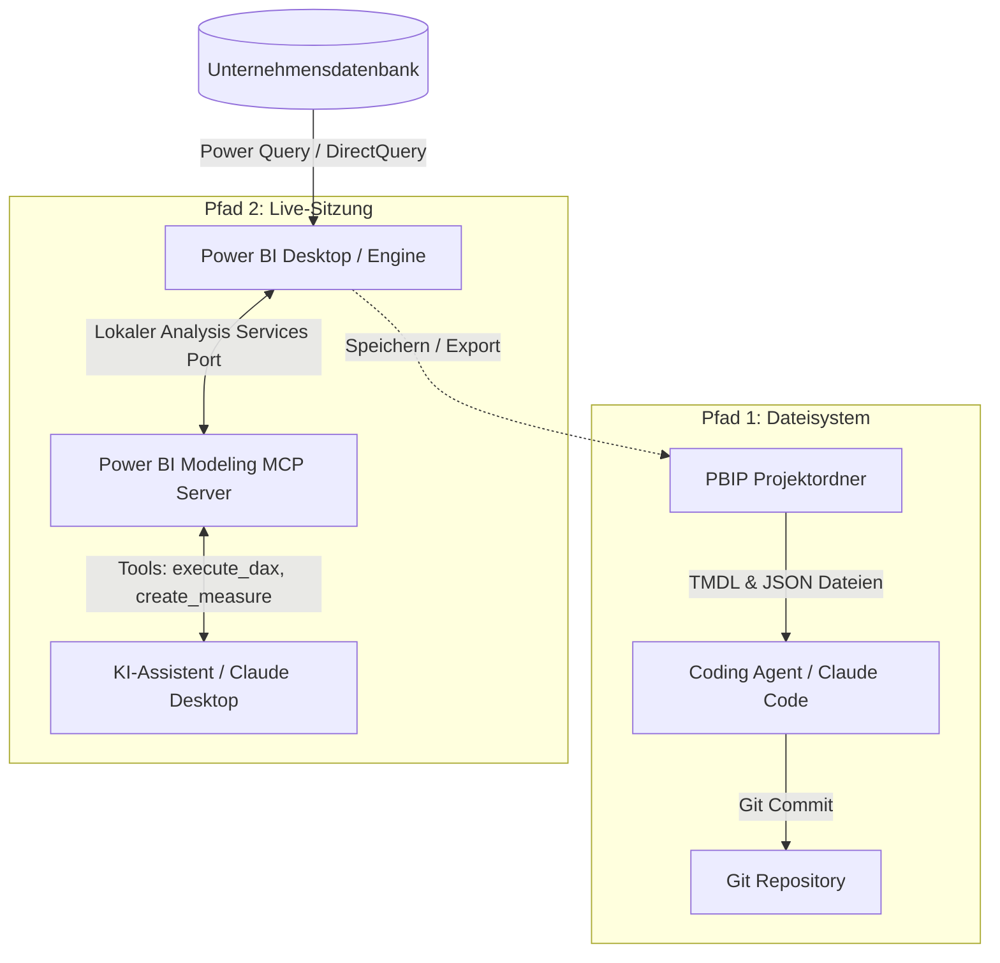

Beim 3. Hackathon für Business Intelligence und KI an der Universidad Americana stand eine zentrale Frage im Raum: Wie steuert man ein Power-BI-Modell verlässlich mit KI-Agenten, ohne im Blindflug zu landen?


*Teilnehmer und Mentoren beim 3. Hackathon für Business Intelligence und KI an der Universidad Americana (3. Oktober 2026).*

Drei Ansätze stehen in der Praxis zur Auswahl:
* **Dateiebene (PBIP):** Git-basierte TMDL-Dateien offline mit Coding-Agenten bearbeiten.
* **Live-Sitzung (MCP):** Über Microsofts Analysis Services MCP Server direkt in die offene Power BI Desktop Instanz eingreifen.
* **Cloud (Microsoft Copilot):** Fertige KI-Funktionen in Microsoft Fabric nutzen.

Jeder dieser Pfade löst ein anderes Problem. Keiner kann alles.

---

## Architektur-Überblick: Wie Daten und KI zusammenspielen

Bevor man über KI spricht, muss die Datenebene geklärt sein.

Power BI übernimmt die direkte Anbindung an die Datenquellen (SQL Server, PostgreSQL, ERP-Systeme oder Data Warehouses) über Power Query, DirectQuery oder geplante Importe. Der KI-Agent benötigt **keinen direkten Zugriff auf die Produktivdatenbank** und keine Datenbank-Zugangsdaten. Stattdessen operiert die KI ausschließlich auf der semantischen Modellschicht (Tabellenbeziehungen, Kennzahlen und DAX-Logik).



Diese Trennung bietet einen wesentlichen Governance-Vorteil: Bestehende Sicherheitsrichtlinien, Rollenrechte und Firewalls verbleiben vollständig in Power BI. Die KI formt lediglich die Berechnungslogik und die visuelle Aufbereitung.

---

## Pfad 1: Dateibasierte Modellierung über PBIP (TMDL)

Klassische `.pbix`-Dateien sind binäre ZIP-Archive, die für KI-Modelle unlesbar sind. Speichert man den Bericht als `.pbip` (Power BI Project), zerlegt Power BI das Modell in Klartext:

* **Semantisches Modell:** Tabellen, Relationen und DAX-Measures liegen als TMDL-Dateien (Tabular Model Definition Language) vor.
* **Berichtsdefinition:** Diagramme, Formatierungen und Filterstrukturen liegen als strukturierte JSON-Dateien vor.

Ein Coding-Agent (wie Claude Code oder ein CLI-basierter Agent) kann direkt im Projektordner arbeiten, die TMDL-Strukturen analysieren und neue Measures in den Code schreiben.

### Reale Einschränkungen von Pfad 1

Trotz der perfekten Eignung für Git und CI/CD hat dieser rein dateibasierte Ansatz klare Nachteile:

* **Keine Live-Syntaxprüfung:** Der Agent schreibt DAX-Formeln blind in die Textdateien. Syntaxfehler fallen erst auf, wenn das Projekt in Power BI Desktop geöffnet oder neu geladen wird.
* **Keine Testabfragen:** Der Agent kann keine `execute_dax`-Abfragen ausführen, um zu prüfen, ob die Berechnung mit den echten Daten übereinstimmt.
* **Manuelles Neuladen:** Änderungen auf der Festplatte werden nicht automatisch im geöffneten Desktop-Fenster synchronisiert.

---

## Pfad 2: Live-Sitzungssteuerung über MCP

Wenn interaktive Modellierung mit sofortiger Fehlerprüfung gefragt ist, schlägt das Model Context Protocol (MCP) die Brücke.

Die Visual Studio Code Extension **Power BI Modeling MCP Server** bündelt eine eigenständige Executable (`powerbi-modeling-mcp.exe`), die auf den Microsoft Analysis Services Bibliotheken aufsetzt.


*Die Power BI Modeling MCP Server Extension im Visual Studio Code Marketplace.*

### Das Setup im Detail

1. **Executable lokalisieren:** Die Extension installiert die `powerbi-modeling-mcp.exe` lokal im VS Code Erweiterungsordner.
2. **KI-Client konfigurieren:** In der `claude_desktop_config.json` (oder jedem anderen MCP-kompatiblen Client) wird der Server mit dem Argument `--start` hinterlegt:

```json
{
  "mcpServers": {
    "powerbi-modeling-mcp": {
      "command": "C:\\Users\\username\\.vscode\\extensions\\analysis-services.powerbi-modeling-mcp-0.4.0-win32-x64\\server\\powerbi-modeling-mcp.exe",
      "args": ["--start"],
      "env": {}
    }
  }
}
```

3. **Verbindung zur Sitzung:** Sobald Power BI Desktop mit einem Modell geöffnet ist, läuft im Hintergrund eine lokale Analysis-Services-Instanz. Ein Prompt an die KI genügt: *"Verbinde dich mit meiner aktiven Power BI Sitzung."*


*Der Power BI Modeling MCP Server aktiv verbunden in Claude Desktop.*

Der MCP-Server dockt an den lokalen Port an. Die KI erhält konkrete Werkzeuge: Schema abfragen, Measures anlegen und DAX-Abfragen direkt ausführen. Meldet die Engine einen Syntaxfehler, erhält die KI die Fehlermeldung im selben Schritt und korrigiert den Code selbstständig.

---

## Pfad 3: Microsoft Copilot für Power BI

Microsoft bietet mit Copilot auch eine direkt integrierte KI-Funktion in der Cloud-Oberfläche und im Desktop an.

* **Kosten und Lizenzierung:** Microsoft Copilot erfordert zwingend bezahlte Microsoft Fabric Kapazitäten (mindestens F64 SKU) oder teure Premium-Lizenzen. Das ist für viele Entwickler und mittelständische Unternehmen eine enorme finanzielle Hürde.
* **Geschlossenes System:** Copilot agiert als proprietäre Cloud-Blackbox ohne Eingriffsmöglichkeiten in Prompts, Workflows oder externe Werkzeugketten.
* **Fokus:** Copilot richtet sich vor allem an Fachanwender für Berichts-Zusammenfassungen und einfache Standard-Diagramme, nicht an die tiefe Datenmodellierung.

---

## Können alle drei Wege alles? Der direkte Fähigkeiten-Vergleich

Kein Werkzeug deckt alle Anforderungen ab. Die drei Ansätze unterscheiden sich in ihren Stärken und Grenzen grundlegend:

| Anforderung / Funktion | Pfad 1: PBIP (Dateiebene) | Pfad 2: MCP Server (Live) | Pfad 3: Microsoft Copilot |
| :--- | :--- | :--- | :--- |
| **DAX-Measures erstellen** | Ja (Stapelverarbeitung in TMDL) | Ja (direkt im Modell injiziert) | Ja (über Chat-Prompt) |
| **Live-Syntaxprüfung** | Nein (blinde Textbearbeitung) | Ja (sofortiges Engine-Feedback) | Eingeschränkt (nur Heuristik) |
| **DAX-Testabfragen (`execute_dax`)** | Nein (keine laufende Engine) | Ja (direkte Abfrage der Engine) | Nein |
| **Git-Versionskontrolle & CI/CD** | Exzellent (reine Text-Diffs) | Manuell (Modell muss erst gespeichert werden) | Keine (Cloud-gebunden) |
| **Visuelles Layout & Diagramme** | Eingeschränkt (blinde JSON-Bearbeitung) | Nein (reiner Modellierungsfokus) | Ja (erstellt Visuals auf der Canvas) |
| **Individuelle SVG-Karten & HTML** | Eingeschränkt (blinder DAX-Code) | Exzellent (sofortige visuelle Vorschau) | Unbrauchbar (nur Standard-Visuals) |
| **Kosten & Modell-Freiheit** | Kostenlos (jedes LLM / lokale Modelle) | Kostenlos (jeder MCP-Client) | Sehr teuer (zwingend Fabric F64) |
| **Laufzeit-Voraussetzung** | Nur Code-Editor / CLI nötig | Power BI Desktop muss lokal laufen | Aktives Fabric Cloud-Abonnement |

### Fazit der Fähigkeiten

* **PBIP wählen**, wenn Versionskontrolle in Git, CI/CD-Pipelines und die massenhafte Measure-Erstellung ohne geöffnetes Power BI Desktop im Vordergrund stehen.
* **MCP wählen**, wenn man aktiv am Arbeitsplatz modelliert und Live-Validierung, direkte Fehlerkorrektur der Engine sowie anspruchsvolle SVG-Visuals benötigt.
* **Copilot wählen**, wenn ein hohes Fabric-Budget vorhanden ist und Standard-Berichtsseiten schnell für Fachbereiche generiert werden sollen.

---

## Praxisnutzen und Reality Check

### Wo das Hackathon-Setup überzeugt hat

* **Dynamische SVG-Measures:** Die Kombination aus dem HTML-Visual in Power BI und DAX-Measures, die dynamischen SVG-Code erzeugen. Individuelle KPI-Karten und Statusanzeigen von Hand in DAX-SVG zu codieren dauert Stunden. Eine KI liefert diese Berechnungen in Sekunden.
* **Measure-Scaffolding:** Bei einem definierten semantischen Modell erstellt der Agent Dutzende Standard-Measures (Vorjahresvergleiche, Margen, rollierende Durchschnitte) in einem Durchgang.

### Der Reality Check

* **Hoher Token-Verbrauch:** Die Übermittlung des Modells, der Tabellenschemata und des Geschäftskontexts frisst große Mengen an Kontext-Tokens. Kostenlose API-Limits sind schnell erschöpft.
* **Datenbereinigung bleibt Menschenarbeit:** Eine KI repariert kein unsauberes Datenmodell. Wenn die Datenqualität vor der Modellierung nicht stimmt, produziert die KI lediglich falsche Zahlen in höherer Geschwindigkeit.

---

## Fazit

Power BI mit KI zu steuern bedeutet nicht, ein Alleskönner-Werkzeug zu suchen, sondern den passenden Pfad für das Problem zu wählen. PBIP bringt die Disziplin moderner Softwareentwicklung in Git, MCP gibt Entwicklern einen interaktiven Assistenten mit echter Engine-Validierung, und Cloud-Tools decken Standard-Reporting ab. Das logische Denken bleibt in Menschenhand, während die Umsetzungsgeschwindigkeit massiv steigt.
