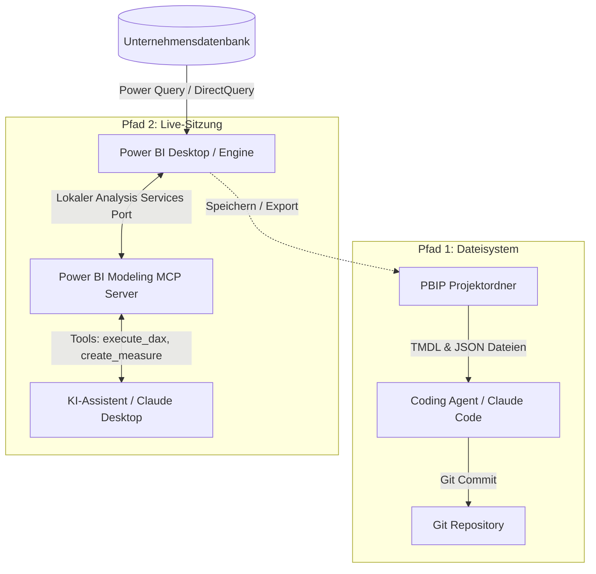

Eine der wichtigsten Fragen beim Hackathon war: Wie verbindet man Power BI mit KI? Konkret: Wie steuert und automatisiert man Datenmodelle in Power BI mit KI-Agenten?


In der Praxis existieren dafür zwei klar getrennte Architekturpfade:
1. Dateibasierte Modellierung über das PBIP-Format (offline, voll versionierbar in Git).
2. Live-Sitzungssteuerung über das Model Context Protocol (MCP).

Wie beide Pfade funktionieren, an welcher Stelle die Datenbank angebunden wird und wo die realen Grenzen liegen, entscheidet darüber, ob der Einsatz im Geschäftsbetrieb funktioniert.

---

## Architektur-Überblick: Wie Daten und KI zusammenspielen

Bevor man über KI spricht, muss die Datenebene geklärt sein.

Power BI übernimmt die direkte Anbindung an die Datenquellen (SQL Server, PostgreSQL, ERP-Systeme oder Data Warehouses) über Power Query, DirectQuery oder geplante Importe. Der KI-Agent benötigt **keinen direkten Zugriff auf die Produktivdatenbank** und keine Datenbank-Zugangsdaten. Stattdessen operiert die KI ausschließlich auf der semantischen Modellschicht (Tabellenbeziehungen, Kennzahlen und DAX-Logik).



Diese Trennung bietet einen wesentlichen Governance-Vorteil: Bestehende Sicherheitsrichtlinien, Rollenrechte und Firewalls verbleiben vollständig in Power BI. Die KI formt lediglich die Berechnungslogik und die visuelle Aufbereitung.

---

## Pfad 1: Dateibasierte Modellierung über PBIP (TMDL)

Klassische `.pbix`-Dateien sind binäre ZIP-Archive, die für KI-Modelle unlesbar sind. Speichert man den Bericht als `.pbip` (Power BI Project), zerlegt Power BI das Modell in Klartext:

* **Semantisches Modell:** Tabellen, Relationen und DAX-Measures liegen als TMDL-Dateien (Tabular Model Definition Language) vor.
* **Berichtsdefinition:** Diagramme, Formatierungen und Filterstrukturen liegen als strukturierte JSON-Dateien vor.

Ein Coding-Agent (wie Claude Code oder ein CLI-basierter Agent) kann direkt im Projektordner arbeiten, die TMDL-Strukturen analysieren und neue Measures in den Code schreiben.

### Reale Einschränkungen von Pfad 1

Trotz der perfekten Eignung für Git und CI/CD hat dieser rein dateibasierte Ansatz klare Nachteile:

* **Keine Live-Syntaxprüfung:** Der Agent schreibt DAX-Formeln blind in die Textdateien. Syntaxfehler fallen erst auf, wenn das Projekt in Power BI Desktop geöffnet oder neu geladen wird.
* **Keine Testabfragen:** Der Agent kann keine `execute_dax`-Abfragen ausführen, um zu prüfen, ob die Berechnung mit den echten Daten übereinstimmt.
* **Manuelles Neuladen:** Änderungen auf der Festplatte werden nicht automatisch im geöffneten Desktop-Fenster synchronisiert.

---

## Pfad 2: Live-Sitzungssteuerung über MCP

Wenn interaktive Modellierung mit sofortiger Fehlerprüfung gefragt ist, schlägt das Model Context Protocol (MCP) die Brücke.

Die Visual Studio Code Extension **Power BI Modeling MCP Server** bündelt eine eigenständige Executable (`powerbi-modeling-mcp.exe`), die auf den Microsoft Analysis Services Bibliotheken aufsetzt.


### Das Setup im Detail

1. **Executable lokalisieren:** Die Extension installiert die `powerbi-modeling-mcp.exe` lokal im VS Code Erweiterungsordner.
2. **KI-Client konfigurieren:** In der `claude_desktop_config.json` (oder jedem anderen MCP-kompatiblen Client) wird der Server mit dem Argument `--start` hinterlegt:


```json
{
  "mcpServers": {
    "powerbi-modeling-mcp": {
      "command": "C:\\Users\\username\\.vscode\\extensions\\analysis-services.powerbi-modeling-mcp-0.4.0-win32-x64\\server\\powerbi-modeling-mcp.exe",
      "args": ["--start"],
      "env": {}
    }
  }
}
```

3. **Verbindung zur Sitzung:** Sobald Power BI Desktop mit einem Modell geöffnet ist, läuft im Hintergrund eine lokale Analysis-Services-Instanz. Ein Prompt an die KI genügt: *"Verbinde dich mit meiner aktiven Power BI Sitzung."*


Der MCP-Server dockt an den lokalen Port an. Die KI erhält konkrete Werkzeuge: Schema abfragen, Measures anlegen und DAX-Abfragen direkt ausführen. Meldet die Engine einen Syntaxfehler, erhält die KI die Fehlermeldung im selben Schritt und korrigiert den Code selbstständig.

---

## Was ist mit Microsoft Copilot für Power BI?

Eine häufige Frage lautet: Warum nutzt man nicht einfach den integrierten Microsoft Copilot?

* **Kosten und Lizenzierung:** Microsoft Copilot erfordert zwingend bezahlte Microsoft Fabric Kapazitäten (mindestens F64 SKU) oder teure Premium-Lizenzen. Das ist für viele Teams und mittelständische Unternehmen eine enorme Hürde.
* **Geschlossenes System:** Copilot agiert als proprietäre Cloud-Blackbox ohne Eingriffsmöglichkeiten in Prompts, Workflows oder externe Werkzeugketten.
* **Lokale Kontrolle:** Der Ansatz über PBIP und MCP läuft lokal auf dem Rechner mit beliebigen Modellen (Claude, GPT oder lokale Open-Source-Modelle) ohne laufende Fabric-Infrastrukturkosten.

---

## Praxisnutzen und Reality Check

### Wo das Setup glänzt

* **Dynamische SVG-Measures:** Die Kombination aus dem HTML-Visual in Power BI und DAX-Measures, die dynamischen SVG-Code erzeugen. Individuelle KPI-Karten und Statusanzeigen von Hand in DAX-SVG zu codieren dauert Stunden. Eine KI liefert diese Berechnungen in Sekunden.
* **Measure-Scaffolding:** Bei einem definierten semantischen Modell erstellt der Agent Dutzende Standard-Measures (Vorjahresvergleiche, Margen, rollierende Durchschnitte) in einem Durchgang.

### Der Reality Check

* **Hoher Token-Verbrauch:** Die Übermittlung des Modells, der Tabellenschemata und des Geschäftskontexts frisst große Mengen an Kontext-Tokens. Kostenlose API-Limits sind schnell erschöpft.
* **Datenbereinigung bleibt Menschenarbeit:** Eine KI repariert kein unsauberes Datenmodell. Wenn die Datenqualität vor der Modellierung nicht stimmt, produziert die KI lediglich falsche Zahlen in höherer Geschwindigkeit.

---

## Fazit

Power BI mit KI zu steuern bedeutet nicht, das analytische Denken abzugeben: Es überführt Power BI in einen modernen, quelltextbasierten Software-Workflow. Ob direkt im TMDL-Quelltext oder live über MCP: Die geschäftliche Logik bleibt in Menschenhand, während die Umsetzungsgeschwindigkeit massiv steigt.
