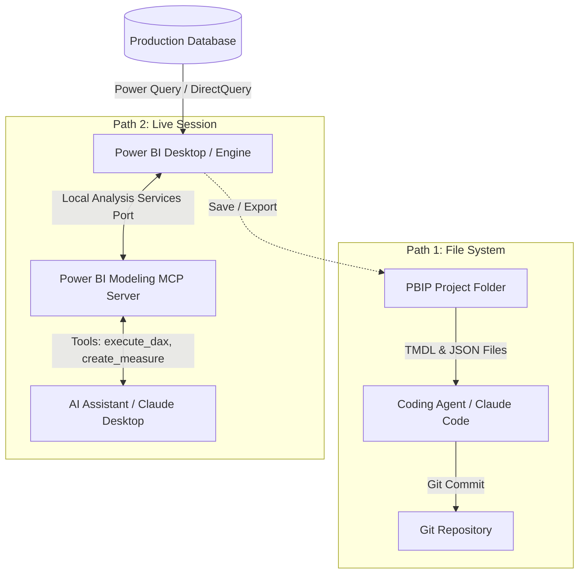
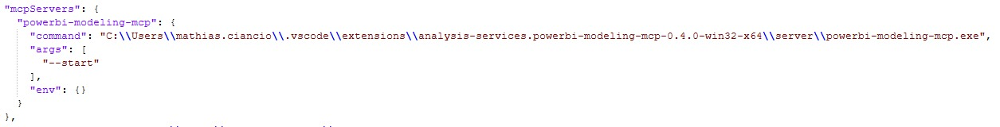

One of the key questions at the hackathon was: How do you connect Power BI with AI? More specifically: How do you use AI agents to model and automate Power BI?


There are two distinct architectural paths to connect AI with Power BI:
1. File-based editing via the PBIP format (offline, Git-integrated).
2. Live session control via the Model Context Protocol (MCP).

Understanding how both paths work, where data connections sit, and where current limitations lie determines whether AI automation actually succeeds in practice.

---

## Architecture Overview: How Data and AI Connect

Before looking at the AI integration, the data connection layer needs clarity.

Power BI connects directly to your data sources (SQL Server, PostgreSQL, ERP systems, or cloud data warehouses) through Power Query, DirectQuery, or scheduled imports. The AI agent does not require direct credentials to your production database. Instead, the agent operates entirely on the semantic model layer (tables, relationships, and DAX calculations).



This separation provides a crucial governance advantage: existing enterprise access controls, firewalls, and data source permissions remain enforced by Power BI. The AI only shapes how data is modeled and aggregated.

---

## Path 1: File-Based Modeling via PBIP (TMDL)

The standard `.pbix` format is a compressed binary archive. An AI model cannot inspect or modify binary blobs. Saving a project as `.pbip` (Power BI Project) splits the report into human-readable plain text:

* **Semantic Model:** Tables, relationships, and DAX measures are stored in TMDL (Tabular Model Definition Language) files.
* **Report Definition:** Visuals, layouts, and filters are stored in JSON format.

A coding agent (such as Claude Code or any terminal-based agent) can open this directory, read the TMDL files, understand the schema, and write new measures directly into the source code.

### Limitations of Path 1

While file-based editing integrates directly with Git workflows, it comes with clear constraints:

* **No live syntax validation:** The agent writes DAX formulas into text files blindly. Syntax errors are only caught when you open or reload the project in Power BI Desktop.
* **No test execution:** The agent cannot run `execute_dax` queries to verify calculation results against actual data.
* **Manual reload required:** Changes made to TMDL files on disk require reloading or reopening Power BI Desktop to reflect in the UI.

---

## Path 2: Live Session Control via MCP

When you need interactive modeling with instant validation, the Model Context Protocol (MCP) bridges the gap.

Microsoft provides the **Power BI Modeling MCP Server** extension for Visual Studio Code. This extension packages a dedicated executable (`powerbi-modeling-mcp.exe`) built on Microsoft Analysis Services libraries.


### How the Setup Works

1. **Locate the Executable:** The extension installs `powerbi-modeling-mcp.exe` inside your local VS Code extension folder.
2. **Configure the AI Client:** In `claude_desktop_config.json` (or any MCP-compatible client), register the server path with the `--start` argument:



```json
{
  "mcpServers": {
    "powerbi-modeling-mcp": {
      "command": "C:\\Users\\username\\.vscode\\extensions\\analysis-services.powerbi-modeling-mcp-0.4.0-win32-x64\\server\\powerbi-modeling-mcp.exe",
      "args": ["--start"],
      "env": {}
    }
  }
}
```

3. **Connect to the Active Session:** Open Power BI Desktop with your data model. Then prompt the AI: *"Connect to my active Power BI session."*


Because Power BI Desktop runs a local Analysis Services instance in the background, the MCP server attaches to its local port. The AI receives functional tools: inspecting tables, creating measures, and running DAX test queries. If a formula fails, the engine returns the error message immediately, allowing the AI to self-correct in real time.

---

## What About Microsoft Copilot for Power BI?

A common question is why not simply rely on Microsoft Copilot built into Power BI.

* **Cost and Licensing:** Microsoft Copilot requires paid Microsoft Fabric capacity (minimum F64 SKU) or Premium capacity, creating significant cost barriers for individual developers or mid-sized teams.
* **Closed Ecosystem:** Copilot is a closed cloud feature. It does not allow custom prompt engineering, agentic chaining, or external tool execution.
* **Local Control:** The MCP and PBIP approach works locally on your machine with any model (Claude, GPT, or local open source models) without recurring Fabric infrastructure fees.

---

## Practical Strengths and Reality Check

### Where the Setup Excels

* **Dynamic SVG Measures:** Building custom KPI cards by combining Power BI's HTML visual with DAX measures that generate dynamic SVG code. Crafting complex SVG strings manually takes hours. An AI generates working DAX SVG measures in seconds.
* **Measure Scaffolding:** Generating batches of standard measures (YoY growth, moving averages, period-to-date) across an established semantic model in one pass.

### The Reality Check

* **High Token Usage:** Passing the entire semantic model, relationship graph, and business context consumes a large volume of tokens. Free API tiers run out quickly.
* **Data Hygiene Precedes Automation:** An AI cannot fix a broken data model. If upstream data cleaning and business definitions are unclear, automated measures will only produce faster incorrect numbers.

---

## Conclusion

Connecting Power BI with AI is not about replacing analytical thinking: it is about shifting Power BI into a modern, code-driven software workflow. Whether editing TMDL directly or driving live models via MCP, the business logic remains under human direction while the execution speed scales significantly.
