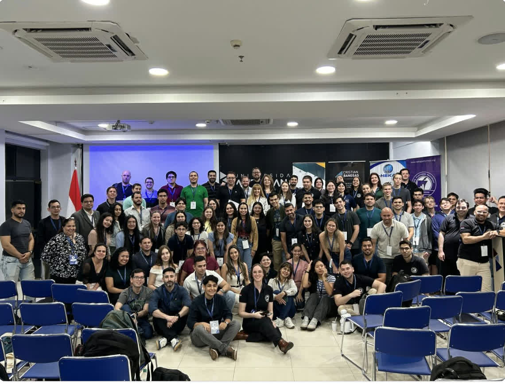
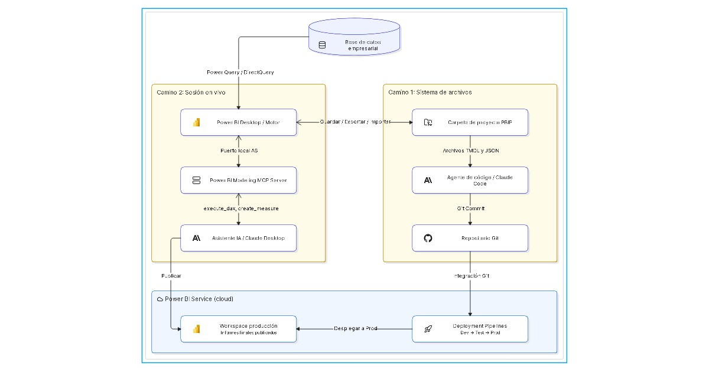
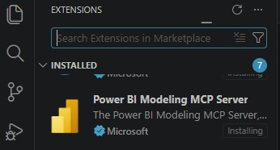
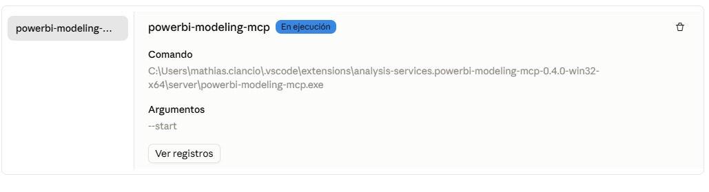

En la 3ra Edición de la Hackathon de Inteligencia de Negocios e IA en la Universidad Americana, el debate central fue concreto: ¿Cómo controlar un modelo de Power BI de forma confiable mediante agentes de IA?


*Participantes y mentores en la 3ra Edición de la Hackathon de Inteligencia de Negocios e IA en la Universidad Americana (3 de octubre de 2026).*

En la práctica existen tres opciones principales:
* **Nivel de archivos (PBIP):** Editar archivos TMDL integrados con Git mediante agentes de código.
* **Sesión en vivo (MCP):** Interactuar con la instancia activa de Power BI Desktop a través del servidor MCP de Analysis Services.
* **Nube (Microsoft Copilot):** Utilizar las capacidades integradas de IA en Microsoft Fabric.

Cada uno de estos caminos resuelve un problema distinto. Ninguno lo abarca todo.

---

## Panorama de arquitectura: Cómo interactúan los datos y la IA

Antes de hablar de IA, es indispensable entender la capa de datos.

Power BI se encarga de la conexión directa a los orígenes de datos (SQL Server, PostgreSQL, sistemas ERP o data warehouses) mediante Power Query, DirectQuery o importación programada. El agente de IA **no necesita acceso directo a la base de datos de producción** ni requiere credenciales de la misma. En su lugar, la IA opera exclusivamente sobre la capa del modelo semántico (tablas, relaciones y medidas DAX).


*Resumen de arquitectura: Modelado basado en archivos vía PBIP (Camino 1) versus sesión en vivo vía MCP (Camino 2) y despliegue a Power BI Service.*

Esta separación aporta una ventaja fundamental de gobernanza: las políticas de seguridad, permisos de usuario y firewalls permanecen dentro de Power BI. La IA solo interactúa con la lógica de cálculo y la estructura visual.

---

## Camino 1: Modelado basado en archivos con PBIP (TMDL)

Los archivos clásicos `.pbix` son paquetes binarios comprimidos que resultan ilegibles para los modelos de IA. Al guardar el informe como `.pbip` (Power BI Project), Power BI descompone el modelo en texto plano:

* **Modelo semántico:** Las tablas, relaciones y medidas DAX se guardan como archivos TMDL (Tabular Model Definition Language).
* **Definición de informes:** Los gráficos, formatos y filtros se guardan en archivos JSON estructurados.

Un agente de desarrollo (como Claude Code o cualquier herramienta de terminal) puede trabajar directamente sobre la carpeta, analizar el esquema TMDL y escribir nuevas medidas en el código fuente. Esto funciona de inmediato sin herramientas intermedias ni software abierto.

### Limitaciones reales del Camino 1

Aunque este método se integra perfectamente con Git y flujos de CI/CD, presenta restricciones claras:

* **Sin validación de sintaxis en tiempo real:** El agente escribe fórmulas DAX directamente en los archivos de texto. Si hay un error, solo se detecta al abrir o recargar el proyecto en Power BI Desktop.
* **Sin ejecución de consultas de prueba:** El agente no puede ejecutar consultas de prueba (`execute_dax`) contra el motor para comprobar si los números calculados son correctos.
* **Recarga manual:** Las modificaciones realizadas en el disco no se reflejan automáticamente en la ventana abierta de Power BI Desktop sin reiniciar o recargar.

---

## Camino 2: Control en sesión viva mediante MCP

Cuando se requiere modelado interactivo con validación inmediata, el Model Context Protocol (MCP) proporciona el enlace necesario.

La extensión para Visual Studio Code **Power BI Modeling MCP Server** empaqueta un ejecutable independiente (`powerbi-modeling-mcp.exe`) basado en las librerías de Microsoft Analysis Services.


*La extensión Power BI Modeling MCP Server en Visual Studio Code Marketplace.*

### Pasos de configuración

1. **Ubicar el ejecutable:** La extensión instala `powerbi-modeling-mcp.exe` localmente en la carpeta de extensiones de VS Code.
2. **Configurar el cliente de IA:** En `claude_desktop_config.json` (o cualquier cliente compatible con MCP), registrar el servidor con el parámetro `--start`:

```json
{
  "mcpServers": {
    "powerbi-modeling-mcp": {
      "command": "C:\\Users\\username\\.vscode\\extensions\\analysis-services.powerbi-modeling-mcp-0.4.0-win32-x64\\server\\powerbi-modeling-mcp.exe",
      "args": ["--start"],
      "env": {}
    }
  }
}
```

3. **Conectar a la sesión activa:** Abrir Power BI Desktop con el modelo de datos, ya sea guardado como `.pbix` o como `.pbip`. Enviar una instrucción a la IA: *"Conéctate a mi sesión activa de Power BI."*


*El servidor Power BI Modeling MCP conectado activamente en Claude Desktop.*

Dado que Power BI Desktop levanta una instancia local de Analysis Services en segundo plano para cada modelo abierto, el servidor MCP se conecta directamente a ese puerto local. La IA obtiene herramientas concretas: consultar esquemas, generar medidas y ejecutar consultas DAX de prueba. Si el motor devuelve un error de sintaxis, la IA recibe la notificación en el mismo paso y corrige el código de inmediato.

---

## Camino 3: Microsoft Copilot para Power BI

Microsoft ofrece también funciones integradas de IA directamente en el servicio en la nube y en Power BI Desktop mediante Copilot.

* **Enfoque en lienzo y diseño:** Copilot genera páginas de informe y visuales estándar directamente en el lienzo dentro del ecosistema Microsoft, pero no está pensado para modelado semántico profundo.
* **Dependiente de la nube:** El procesamiento siempre se realiza en la nube de Microsoft y exige una capacidad activa de Fabric (mínimo SKU F64) asignada en el tenant.
* **Costos y dependencia de plataforma:** Costos de plataforma elevados para capacidades dedicadas y un entorno cerrado sin acceso a prompts de sistema ni herramientas externas.

---

## ¿Pueden las tres opciones hacer todo por igual? Comparativa directa de capacidades

Ninguna herramienta cubre la totalidad del flujo. Cada alternativa presenta ventajas y limitaciones evidentes:

| Requisito / Capacidad | Camino 1: PBIP (Nivel archivos) | Camino 2: Servidor MCP (En vivo) | Camino 3: Microsoft Copilot |
| :--- | :--- | :--- | :--- |
| **Formatos compatibles** | Solo PBIP (sistema de archivos) | Tanto PBIX como PBIP | Tanto PBIX como PBIP |
| **Creación de medidas DAX** | Sí (por lotes en TMDL) | Sí (inyección directa al motor) | Sí (prompt en chat) |
| **Validación de sintaxis en vivo** | No (edición ciega de texto) | Sí (respuesta inmediata del motor) | Parcial (solo heurística) |
| **Consultas de prueba (`execute_dax`)** | No (sin motor en ejecución) | Sí (consulta directa al motor) | No |
| **Integración con Git y control de versiones** | Excelente (diffs de texto nativos) | Disponible con PBIP tras guardar | Ninguna (ligado a la nube) |
| **Requisitos de hardware** | Mínimos (CLI o editor de código) | Altos (Power BI Desktop y RAM) | Ninguno (hospedaje en nube) |
| **Privacidad de datos** | Controlada por el LLM elegido | Controlada por el LLM elegido | Almacenado en la nube de Microsoft |
| **Soporte para DirectQuery** | Limitado (solo metadatos) | Complejo (latencia de consulta) | Sí (soporte nativo en la nube) |
| **Diseño visual en el lienzo** | Limitado (edición ciega de JSON) | No (enfoque exclusivo en modelado) | Sí (crea visuales en el lienzo) |
| **Tarjetas SVG a medida y HTML** | Limitado (cadena DAX a ciegas) | Excelente (vista previa en vivo) | Inadecuado (solo visuales estándar) |
| **Costo y flexibilidad de modelos** | Gratuito (cualquier LLM o local) | Gratuito (cualquier cliente MCP) | Alto (licencia de usuario o Fabric F64) |
| **Requisito de ejecución** | Solo editor de código / CLI | Power BI Desktop abierto localmente | Suscripción activa a Fabric |

*En resumen: el Camino 1 destaca en automatización sin configuración previa, el Camino 2 es la opción superior para el modelado activo con validación en vivo, y el Camino 3 genera diseños en el lienzo dentro del ecosistema Microsoft.*

---

## Utilidad práctica y realidad operativa

### Dónde destacó la solución del hackathon

* **Medidas dinámicas con SVG:** Combinar el visual HTML de Power BI con medidas DAX que generan código SVG dinámico permite crear tarjetas KPI e indicadores personalizados. Programar código SVG en DAX a mano toma horas; la IA genera la medida en segundos.
* **Scaffolding de medidas:** Con un modelo semántico definido, el agente genera decenas de medidas estándar (comparativas año contra año, márgenes, promedios móviles) en una sola operación.

### Realidad operativa

* **Alto consumo de tokens:** Transferir el modelo semántico, las tablas y el contexto de negocio consume una gran cantidad de tokens de contexto. Los límites de uso en planes gratuitos se agotan con rapidez.
* **La limpieza de datos sigue siendo trabajo humano:** La IA no puede corregir un modelo de datos deficiente. Si la calidad de los datos de origen no está asegurada, la IA solo producirá cálculos incorrectos a mayor velocidad.

---

## Conclusión

1. **PBIP es la base obligatoria:** Controlar versiones en Git exige abandonar el formato binario PBIX. El control de versiones es una propiedad del formato de archivo, no de la herramienta de IA.
2. **MCP domina el desarrollo activo:** Los agentes de archivos carecen de validación de sintaxis y Copilot es una herramienta de conveniencia costosa para visuales genéricos. Para el modelado semántico riguroso, lógica DAX compleja y tarjetas SVG dinámicas, la conexión en vivo mediante MCP es con diferencia la vía más productiva.

---

Un agradecimiento especial a **Matías Ciancio** por la visualización de la arquitectura y el intercambio técnico.
